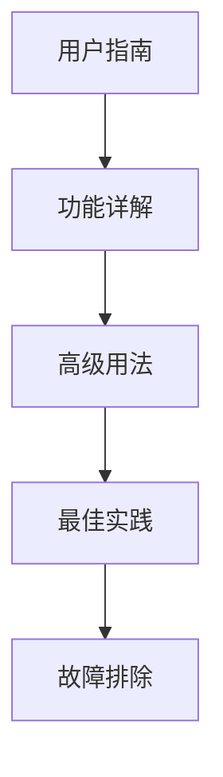

# FCT-AutoQuery 文档中心

欢迎来到 FCT-AutoQuery 项目的文档中心。这里包含了项目的完整文档资源。

## 📚 文档目录

### 🔥 核心文档

| 文档 | 描述 | 适用人群 |
|------|------|----------|
| [FCT 数据分析程序使用指南](./fct-analysis-user-guide.md) | 完整的用户使用指南，包含所有功能说明 | 所有用户 |
| [FCT 数据分析程序快速参考](./fct-analysis-quick-reference.md) | 常用命令和快速上手指南 | 快速查询 |
| [FCT 数据分析程序使用示例](./fct-analysis-examples.md) | 实际使用场景和代码示例 | 开发者、高级用户 |

### 📋 项目文档

| 文档 | 描述 | 状态 |
|------|------|------|
| [需求文档](./requirement.md) | 项目整体需求说明 | 已完成 |
| [功能规格 - 数据挖掘](./feat-005-data-mining.md) | 数据分析功能详细规格 | 已实现 |
| [变更日志](./chg-002-critical-issues.md) | 关键问题修复记录 | 维护中 |
| [数据清理策略](./chg-003-yearly-data-purge.md) | 年度数据清理方案 | 已制定 |

---

## 🚀 快速开始

### 1. 新用户入门
```bash
# 1. 阅读用户指南
cat docs/fct-analysis-user-guide.md

# 2. 运行第一个分析
python -m fct_analysis.cli -i your_data.json --mode rule -o results/

# 3. 查看快速参考
cat docs/fct-analysis-quick-reference.md
```

### 2. 开发者指南
```bash
# 1. 查看实现规格
cat docs/feat-005-data-mining.md

# 2. 参考使用示例
cat docs/fct-analysis-examples.md

# 3. 运行测试
python -m pytest tests/
```

---

## 📖 文档使用建议

### 按角色阅读

#### 👥 律师/分析师
1. **必读**：FCT 数据分析程序使用指南
2. **参考**：FCT 数据分析程序快速参考
3. **进阶**：FCT 数据分析程序使用示例

#### 💻 技术人员
1. **必读**：需求文档、功能规格
2. **开发**：使用示例
3. **维护**：变更日志

#### 🏢 管理员
1. **概览**：需求文档
2. **实施**：用户指南
3. **监控**：数据清理策略

### 按使用场景

#### 🏃‍♂️ 快速上手


#### 📖 深度学习


#### 🔧 自定义开发


---

## 🔍 文档搜索

### 常见问题快速定位

| 问题类型 | 推荐文档 | 章节 |
|----------|----------|------|
| 如何安装 | 用户指南 | 安装与配置 |
| 数据格式要求 | 用户指南 | 输入数据格式 |
| 命令行参数 | 快速参考 | 命令行参数参考 |
| 实际案例 | 使用示例 | 实际案例分析 |
| 性能优化 | 用户指南 | 高级用法 |
| 错误处理 | 用户指南 | 故障排除 |

### 搜索关键词

- **安装相关**：`安装` `配置` `依赖` `环境`
- **数据相关**：`格式` `输入` `输出` `JSON`
- **分析相关**：`规则` `LLM` `分类` `状态`
- **可视化相关**：`图表` `报表` `趋势`
- **性能相关**：`优化` `批量` `内存`

---

## 📝 文档维护

### 更新频率
- **用户指南**：随功能更新
- **快速参考**：按需更新
- **使用示例**：持续补充
- **项目文档**：里程碑更新

### 贡献指南
1. **新增示例**：添加到 `fct-analysis-examples.md`
2. **发现问题**：更新相关文档的故障排除部分
3. **功能变更**：同步更新用户指南和规格文档
4. **文档改进**：提交 PR 或 Issue

---

## 🤝 获取帮助

### 文档问题
如果发现文档错误或有改进建议：
1. 检查是否有相关 Issue
2. 创建新的 Issue 描述问题
3. 提交 PR 修复文档

### 功能问题
如果遇到功能使用问题：
1. 查阅用户指南的故障排除章节
2. 参考使用示例中的类似场景
3. 查看项目的测试用例

### 开发支持
如果需要开发支持：
1. 查看功能规格文档
2. 参考现有实现代码
3. 运行相关测试用例

---

## 📊 文档统计

| 文档 | 字数 | 章节数 | 最后更新 |
|------|------|--------|----------|
| fct-analysis-user-guide.md | ~8,000 | 10 | 2024-12-09 |
| fct-analysis-quick-reference.md | ~2,000 | 5 | 2024-12-09 |
| fct-analysis-examples.md | ~12,000 | 10 | 2024-12-09 |
| feat-005-data-mining.md | ~3,000 | 8 | 2024-12-09 |

---

*最后更新：2024年12月9日*